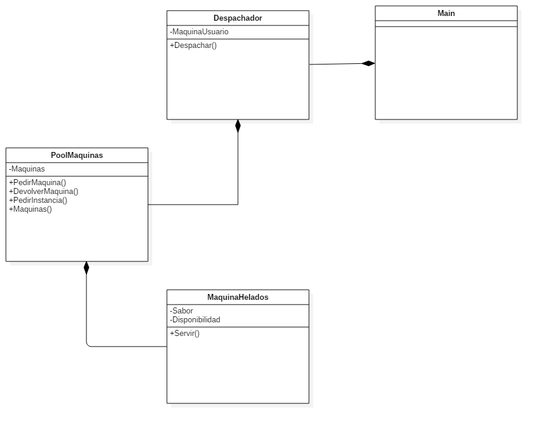

# Helados
Pool de objetos y factory para máquina dispensadora de helados.

# Grupo de trabajo
Juan Camilo Navarro Quiroga  
Juan Pablo Perea  
Nicolas Velasquez Romero

# Descripción
En este programa se desarrollará la dispensadora de helados, de tal manera que se utilice uno de los patrones de diseño, el pool de objetos, con el fin de mantener la idea de que la máquina de helados sólo puede realizar un helado a la vez, sin embargo puede mantener una cola de espera para realizar todos sus pedidos.

# Diagrama de Clase 
.
